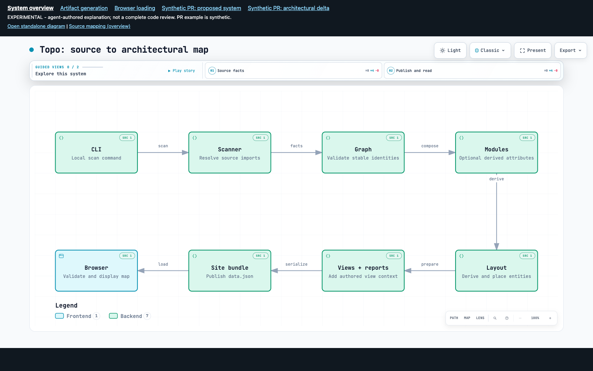

# Preserved Archify wrapper experiment

**Prototype preservation, not production integration.** All three bounded
proofs of concept supported wrapping unmodified Archify within the tested limits.
Start with a pinned CLI wrapper; fork only when concrete requirements justify it.
This directory is independent of the product build, scanner, and dependencies.

## Open the historical example

Open [`site/pr-34/index.html`](site/pr-34/index.html) in a browser, including
directly with `file://`. No build, installation, server, or network is needed.
Navigate overview → generation/loading → overview; open standalone for native
search, source panels, directed routes, chapters, and export.
`pr-34` names a **synthetic preview fixture**, not a deployed pull request.



- [Full original findings](FINDINGS.md): all verdicts, limitations and corrections.
- [Product vision and separately dated human feedback](VISION.md).
- [Original investigation plan](PLAN.md), associated with
  [issue #34](https://github.com/jdylanmc/topo-code/issues/34).
- [Provenance, attribution and preservation rules](PROVENANCE.md).
- [Final original results](evidence/results.json), [browser observations](evidence/browser-1789503874206.json),
  [initial failed layout diagnostic](evidence/overview.json).
- [Overview](site/pr-34/overview.artifact.visual-check.html),
  [generation](site/pr-34/generation.artifact.visual-check.html), and
  [loading](site/pr-34/loading.artifact.visual-check.html) native light/dark contact sheets.

**Read historical claims in their original context.** `FINDINGS.md`, `PLAN.md`,
receipts, specs, and site bytes are unchanged historical records. Their
session-only paths, scratch-storage statements, old reproduction commands and
“pending” feedback describe the original run, not today's preservation location.
Use the portable commands below instead. Original scripts are preserved as
non-executable `.mjs.txt` evidence; top-level scripts are adapted portable copies.

The source fixture describes topo-code at
`339135da2792046a422308fbc8e5b54ead5828cd`, **not current main**.
Main's newer [logical architecture](../../docs/logical-architecture.md) from
[#33](https://github.com/jdylanmc/topo-code/issues/33) is separate shipped work.
This experiment neither replaces it nor claims to demonstrate its implementation.

## Reproduce without changing the capture

Use Node.js 22+ and Git. Original observation used Node 24.20.0, macOS and Chrome.
Run commands from this directory:

```sh
node --test preservation.test.mjs
```

The contract tests need no dependencies. To regenerate, explicitly bootstrap
only the pinned upstream working files (Git/network required, no root dependencies):

```sh
git init .upstream
git -C .upstream remote add origin https://github.com/tt-a1i/archify.git
git -C .upstream sparse-checkout init --no-cone
git -C .upstream sparse-checkout set /archify/
git -C .upstream fetch --depth=1 --filter=blob:none origin d673e8300df60a5c8166abe78787fdc78f6b8000
git -C .upstream checkout --detach FETCH_HEAD
node experiment.mjs
```

The bootstrap commands are for a new `.upstream`; do not overwrite an existing
checkout. Alternatively set `ARCHIFY_ROOT` to an existing checkout/extracted
archive root containing `archify/`. The wrapper checks every packaged Archify
file against `upstream-files.json` **before executing** the CLI. Missing or
changed files fail explicitly; do not silently upgrade or edit upstream.
No upstream archive, node_modules, unrelated docs, or Git objects are vendored.

`TOPO_REPO` optionally points to a local topo-code Git checkout. Default is this
repository. It must contain the pinned historical revision; a shallow clone may
need the explicit `git fetch origin 339135da2792046a422308fbc8e5b54ead5828cd`.
Source is read with `git show`, never checked out or rewritten.

`experiment.mjs` writes only `.generated/{specs,site,evidence}`. It checks delivery,
repeatability, last-good preservation, malformed inputs, missing evidence and
endpoints, unsupported node href, synthetic freshness guards, semantic delta,
and movement classification. It also reconstructs the initial failed layout
by removing the final `labelAt`; that new input is not an original capture.
Regenerated HTML should match the historical bytes for frozen inputs; receipt
paths/timings and browser screenshots are environment-dependent.

### Browser verification

```sh
# Uses checked-in snapshot; requires an available Playwright module/browser.
node browser.mjs
# Uses newly generated snapshot:
POC_SITE="$PWD/.generated/site" node browser.mjs
```

`PLAYWRIGHT_MODULE` may be an absolute path to an existing Playwright `index.mjs`.
Otherwise normal Node resolution looks for `playwright`.
`CHROME_PATH` may point to an installed Chrome executable; if unset Playwright
uses its managed Chromium. For example on macOS:

```sh
CHROME_PATH="/Applications/Google Chrome.app/Contents/MacOS/Google Chrome" \
PLAYWRIGHT_MODULE="/absolute/path/to/playwright/index.mjs" node browser.mjs
```

Only if the browser command reports a missing dependency, an isolated optional
installation can be made here (not in the product root):

```sh
npm install --prefix .browser-deps --no-package-lock --no-save playwright@1.63.0
PLAYWRIGHT_MODULE="$PWD/.browser-deps/node_modules/playwright/index.mjs" \
CHROME_PATH="/absolute/path/to/installed/chrome" node browser.mjs
```

The harness writes `.generated/browser-evidence`, starts a loopback server on an
ephemeral port, verifies responsiveness, tests HTTP and direct-file navigation,
and closes browser/server in `finally`. It inspects iframe internals **only for
tests**; wrapper pages do not. No server is left running.
Native visual checks can be repeated separately:

```sh
node "${ARCHIFY_ROOT:-.upstream}/archify/bin/archify.mjs" visual-check .generated/site/pr-34/overview.artifact.html --json
```

Native visual-check has its own browser environment requirements; historical
receipts/contact sheets for all three primary diagrams are included regardless.
Do not run native visual-check against `site/`: it writes adjacent receipts.

## Boundaries that matter

- Agent-authored from inspected code; **scanner was not wired**, no model service
  invoked. Source existence is not semantic truth or complete coverage.
- Architecture source verification caps references at three per component;
  workflow evidence and durable symbol/provenance mapping remain wrapper-owned.
- `components[].href` is rejected. External document links work. Iframe focus
  is lost on cross-page navigation; standalone focus/chapter hashes restore.
- Initial repair text was useful but structured evidence/fixes were empty.
  See original failure and the three browser-harness corrections in findings.
- Native viewer is duplicated: overview 806,921 bytes, delta 2,163,258 bytes.
  Delta scrolls vertically; a uniform full-shell viewport is not established.
- Movement-only changes alter `semanticSha256`: use explicit classifications.
- Freshness tests mutate manifests synthetically. Referenced Git blob checks do
  not prove symbol validity, dirty-tree freshness, semantic truth, or PR coverage.
- Real PR orchestration, CI validation/publication, topo authoring skills,
  multi-document regeneration, full UML/algorithm notation, and FigJam are not
  implemented. **Warn versus block policy is unresolved.**

Follow-up issue publication and product integration belong to the delivery owner,
not these scripts. Preservation tests verify artifacts and recorded boundaries,
not production readiness or independent approval.
